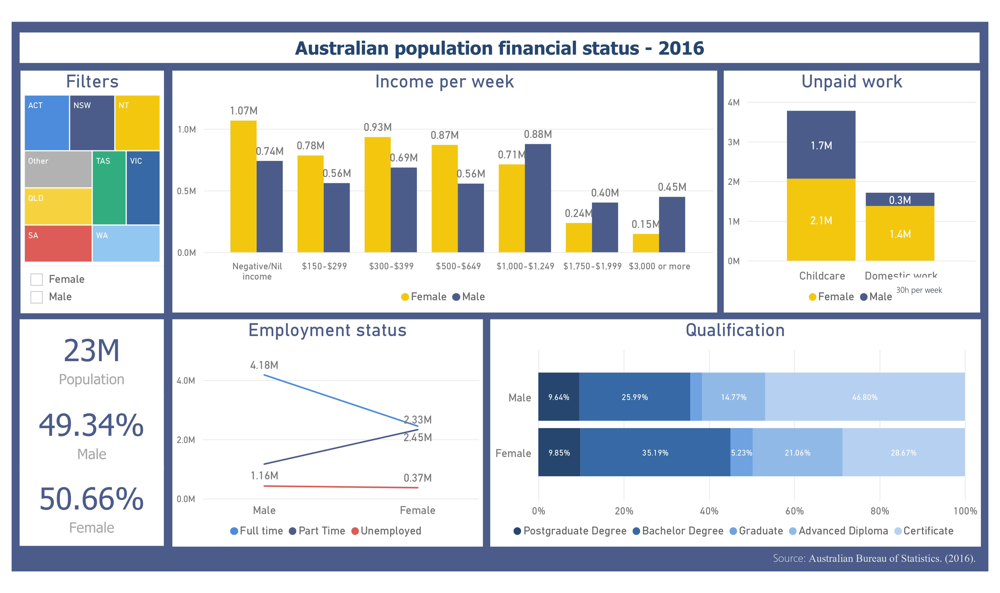

# Data analysis and Business intelligence projects

This repository serves as a brief reflection of my academic journey at the University of Western Australia, culminating in the completion of my Master's in Information Technology in July 2023, with a focus on data analysis and business intelligence projects.

## Academic Highlights

Throughout my master's program, I acquired invaluable insights and honed a diverse set of skills, particularly in the realms of data analysis. I had the opportunity to delve into languages such as R and Python, while also refining my proficiency in tools like Excel and Power BI.

## Key Coursework

The core subjects I engaged with encompassed:

1. **Data Analysis and Decision Making (MGMT5504)**: This course provided a solid foundation in data analysis techniques and decision-making processes. I learned how to extract valuable insights from data and make informed business decisions.

2. **Computational Data Analysis (CITS4009)**: This course focused on advanced data analysis methods using computational tools and algorithms. I acquired hands-on experience in applying data analysis techniques to real-world problems.

3. **Data Warehousing (CITS5504)**: In this course, I delved into the world of data warehousing, understanding how to design, build, and manage data warehouses. I gained expertise in data integration and storage.

4. **Business Intelligence (INMT5526)**: This subject explored the realm of Business Intelligence, covering topics like data visualization, reporting, and dashboard creation. I learned how to transform data into actionable insights for organizations.

## Projects

As part of my coursework, I completed several projects that allowed me to apply the knowledge gained in practical scenarios. Here are brief descriptions of a few of them:

### Project 1: [Data Literacy and BI Tools]

This project, examines gender inequality in Australia, focusing on income disparities, employment status, and education levels using 2016 Australian Census data. The project includes a comprehensive dashboard created with Power BI that visualizes key findings, highlighting the challenges and potential solutions related to gender equality in the Australian workforce. Excel was utilized for data preprocessing and analysis. Through data analysis, the project sheds light on the need for businesses to address social issues like gender inequality, not only for societal benefit but also for potential business growth by tapping into a more diverse consumer market.

### Project 2: [Project Name]

Description: Provide a brief overview of the project, its goals, and the skills/tools you used to complete it.

### Project 3: [Project Name]

Description: Provide a brief overview of the project, its goals, and the skills/tools you used to complete it.

These projects were instrumental in enhancing my practical knowledge and problem-solving abilities.

Feel free to explore this repository to learn more about my academic journey and the projects I've worked on. If you have any questions or would like to connect, please don't hesitate to reach out.

Thank you for visiting!
